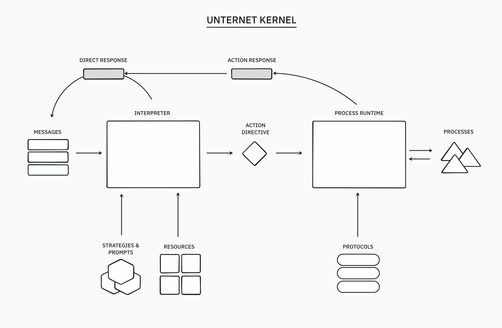

# Unternet Kernel

The Unternet Kernel package contains a collection of useful modules for constructing a "cognitive kernel", used for responding to input and orchestrating actions & processes in an intelligent software client.

## Getting started

```
npm install
npm build
```

To try out the example project:

```
npm run example
```

## Overview

The `@unternet/kernel` package is designed to be a plug-and-play system for assembling your own cognitive kernel. You can take the entire system together, or you can just use the building blocks that are helpful for your application.

The two core modules are the interpreter (which take message inputs, and generates a response) & the process runtime (which kicks off actions, and manages running processes).



## Interpreter

The `Interpreter` class (`interpreter/interpreter`) acts as the main cognitive processing unit for the kernel. When given a series of messages, it will return either a direct response, or an "action directive" to perform an action. Interpreter modules accept arrays of `KernelMessage`, defined in `interpreter/messages`.

You pass the Interpreter a set of `Resource` object. A resource is anything that a model might use to get information or perform an action in response to an input. These objects have associated actions that the kernel can use for its actions directives. A resource could be a web applet, MCP server, or set of system actions.

All resources must have a URI, which is a string that adheres to [RFC3986](https://datatracker.ietf.org/doc/html/rfc3986), an internet standard. For example, the following are valid URIs:

- https://my-applet.example.com/
- mcp:some-mcp-server-identifier
- function:system
- file:///Users/username/my-file.txt

## Process Runtime

The `ProcessRuntime` class handles action directives from the Interpreter, and responds with a the output of a function call, or an ongoing `Process` object.

For example, in response to the input `"what's the weather"`, the interpreter might return an action directive to use the `weather:forecast` resource to get the latest weather forecast. The process runtime is now responsible for taking this directive, and turning it into an output by sending it to the appropriate protocol.

Protocols are developer-created classes that turn actions into outputs. Each protocol corresponds to the given URI scheme for a resource (e.g. `http`, `mcp`, etc.) – so any `mcp:some-server` resource will be sent to the registered `mcp` protocol for action handling.

You can register protocols with `ProcessRuntime`. Then, any time you dispatch an action directive that matches that protocol, you will get a response object that corresponds to the output of that action. Response objects can either consist of a direct return value, or an ongoing process.

A process is an ongoing task that is managed by the `ProcessRuntime` (or can be managed independently). Processes are a bit like resources, in that they can have their own actions & URIs (`process:<pid>`) that the interpreter can use. They're also a bit like Processes, in that they can handle actions. Together, this means you can issue actions to any running process.

## Status

The Unternet Kernel is still in active development. It is designed to act as the foundation of Unternet's client, Undo, and we are prioritizing stability and performance alongside a focused set of features. The kernel is designed to be open, easily extensible, and adaptable. We encourage developers wanting to get started with web applets and other tools to use the kernel as a foundation for their apps.

## Contribute

If you'd like to contribute, we encourage you to visit our issues page, or jump into our discord server. For more details and links, visit [https://unternet.co](https://unternet.co).
